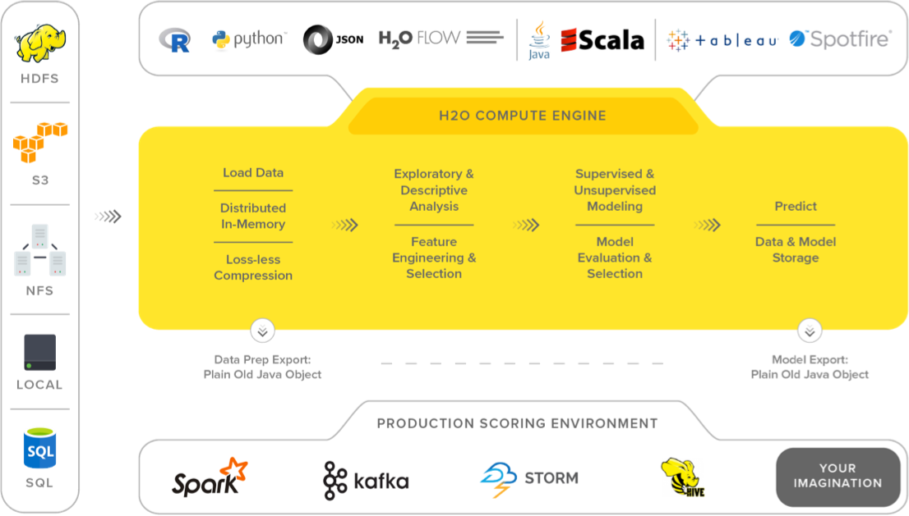

# Install H2O-Driverless

## 1. what is H2O?
H2O는 오픈소스이자, 선형적으로 확장가능한 분산 인메모리(in-memory) 머신러닝 플랫폼입니다.  
또한, 통계학&머신러닝 쪽 다양한 알고리즘을 지원하고 있습니다.
> * Gradient Boosted Machines
>* Generalized linear Models
>* Deep learning  
>...etc

### 1.1 Key Features
- **Leading Algorithm**  
Random Forest, GLM, GBM, XGBoost, GLRM, Word2Vec 등등 
- **Access From R, Python, Flow...**  
python과 R과 같은 언어들로 모델 생성 가능. 또는 H2O Flow같은 GUI환경에서 코딩없이도 가능함.  
- **AutoML**  
AutoML은 머신러닝의 워크플로우를 자동화 시켜주는 기능! 자동 트레이닝, 유저가 정한 시간에 맞춰 모델들을 튜닝시켜주는 기능도 가지고 있음.  
Stacked Ensembles는 AutoML Leaderboard에서 가장 뛰어난 성능을 보인 모델들의 집합으로 트레이닝을 할 수 있음.
>H2O의 stacked ensemble은 supervised 앙상블 머신러닝 알고리즘(supervised ensemble machine learning algorithm)으로, stacking기법을 통해 최적의 알고리즘 조합을 찾습니다.

- **Distributed In-Memory Processing**  
노드와 클러스터간의 빠른 직렬화를통한 In-memory처리방식으로 대규모 데이터셋을 지원합니다.  
빅데이터에 대한 분산 프로세싱은 최대 100배 더 빠른 속도를 제공하고, 정확성의 저하 없이 최적의 효율성을 보일 수 있습니다.

### 1.2 Enterprise Data
H2O는 베어메탈 또는 하둡이나 스파크 클러스터 위에서 돌아갑니다. 또한 HDFS, Spark, S3, Azure Data Lake 또는 아무 데이터 소스에서 데이터를 직접 수집하여 In-memory 분산 키값 저장소로 가져올 수 있습니다.  

## 2. Install and Start H2O
추후 추가