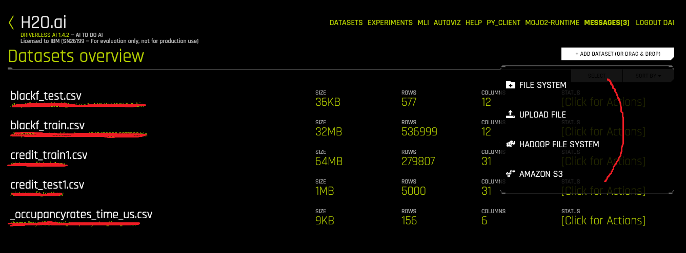

# Training and Scoring Data with H2O-Driverless

## 1. 기본화면

데이터셋들나옴 
데이터셋추가는 파일시스템,하둡,s3에서 갖고오거나 업로드 

데이터 셋당 액션은 4개 
-디테일 : 로우데이터 보여줌
-visualize : 비주얼라라이잉
-predict : 트레이닝시작
-delete : 삭 제

프리딕트화면
호롤리
무슨 칼럼으로 할거니
고르고 런치 버튼 

https://hwengineer.blogspot.com/2018/10/ai-ai-h2o-driverless-ai.html

