# Training and Scoring Data with H2O-Driverless

## 1. OverView
이번 문서에서는 H2O Driverless AI를 사용하여 웹상에서 트레이닝과 특정 column을 골라 스코어링을 하도록 하겠습니다.

## 2. Prerequisites
이전 문서의 튜토리얼을 따라해 주시고 H2O Driverless AI를 올린 웹페이지로 이동해주세요.

## 3. Traning with Datasets

### 3.1 Datasets Overview 

H2O 웹페이지로 이동하면 현재 H2O에 올라가있는 Dataset들의 목록을 볼 수 있습니다.

ADD Dataset버튼을 통해 (H2O가 올라가있는 서버의)파일시스템, 로컬pc의 파일시스템, 하둡과 아마존 S3에서 데이터셋을 업로드를 할 수 있습니다.  

데이터셋을 클릭하면 옵션이 4개가 있습니다.  
> - detail : 데이터셋의 Overview와 로우데이터를 보여줌 
> - visualize : 데이터셋에 대한 각종 그래프
> - predict : 트레이닝 (H2O에서는 예측이라고함)  
> - delete : 데이터셋 삭제  

### Visualize
visualize 버튼을 누르면 나오는 화면. 각 그래프를 확인해볼 수 있습니다.
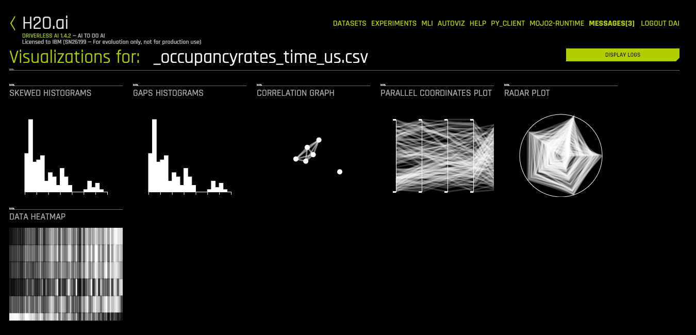

>Correlation graph를 선택한 모습
> 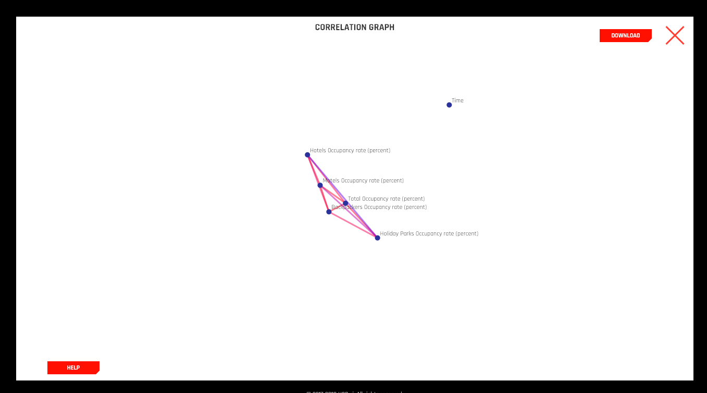

### 3.2 Training
Predict를 누르고 나면 나오는 화면. 어떤 column에 대해서 트레이닝을 할 것인지 정합니다. 
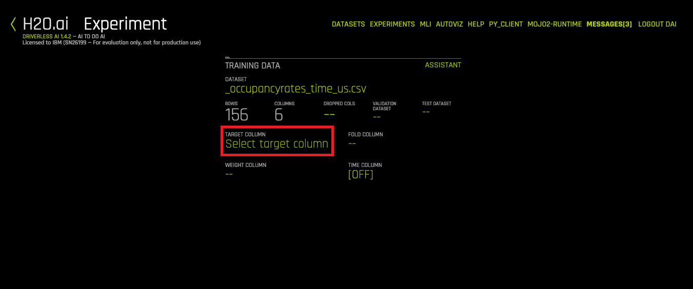

예시로 Hotels Occupancy rate라는 column에 대해 트레이닝을 한다고 설정해줍시다.
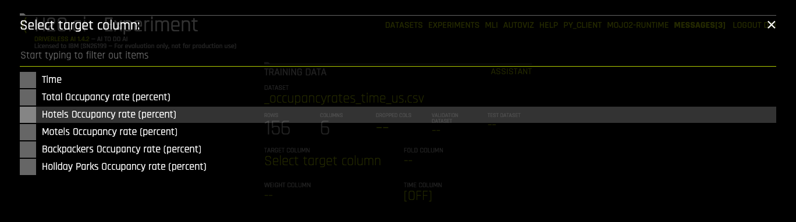

트레이닝을 하기 전, 설정페이지입니다.
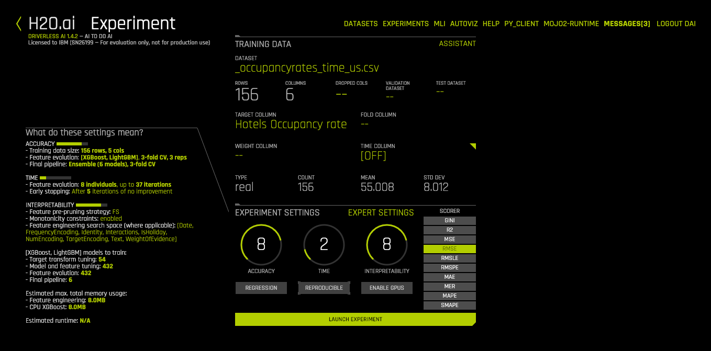
>자세한 설명은 추후 예정  

트레이닝을 실행하게 되면 나오는 페이지입니다.
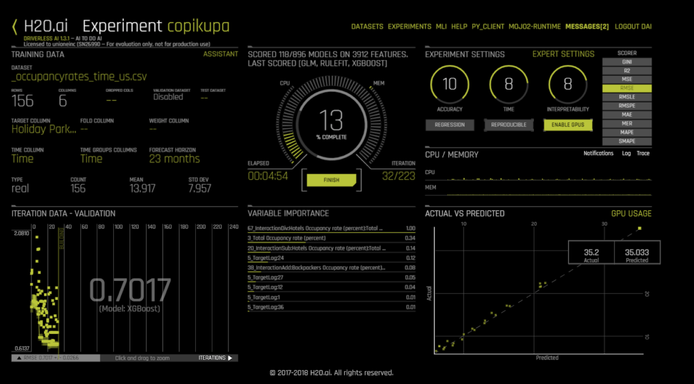
>자세한 설명 추후 예정/ 1.19기준 용량이없어서 다시 테스트를 못해 스크린샷이 없습니다.

## 4. Scoring

트레이닝이 다 끝나고 나면 다음과 같은 결과 페이지가 뜨게 됩니다.  
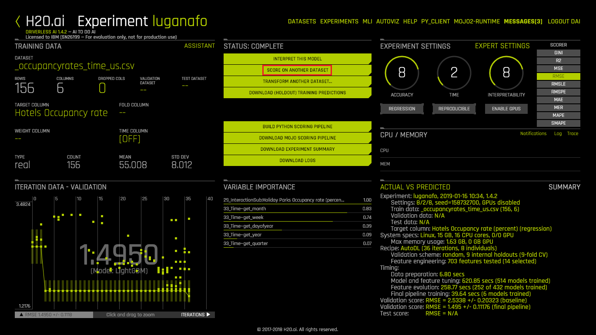

Scoring on another dataset을 누르고 
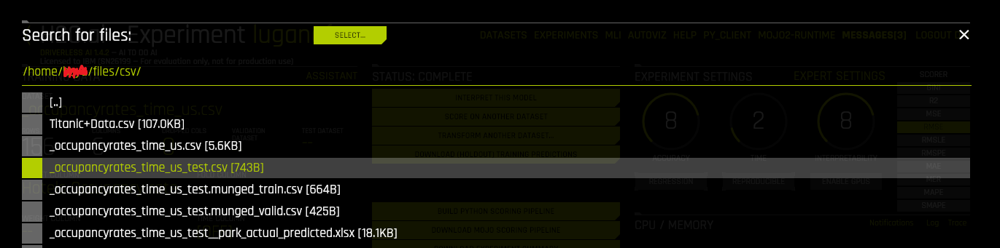
Scoring하려는 dataset을 선택합니다.  
그 후, Download Predictions버튼을 누르게 되면, 예측한 값에 대한 csv파일을 다운로드 받을 수 있습니다.

## 5. MOJO Scoring Pipeline

### 5.1 MOJO
MOJO(Model ObJects, Optimized).  
스코어링 엔진으로, 자바환경에서 배포가 가능합니다.  
유의할 점은 한번 배포되고 나면 자동으로 업그레이드가 안된다는 점입니다. 새로운 MOJO파일을 사용하려면 새롭게 다운로드 받아야 합니다.  

또한 MOJO파일을 실행시키기 위해서는 다음과 같은 준비물이 필요합니다.  
>Java 8 runtime  
>[Driverless의 license](http://docs.h2o.ai/driverless-ai/latest-stable/docs/userguide/scoring-mojo-scoring-pipeline.html#license-specification) 
> - 환경변수 지정
> - `-D`옵션을 통한 지정
> - application의 classpath지정

### 5.2 MOJO Pipeline download
결과페이지에서 MOJO-pipeline.zip을 다운로드 받습니다.  
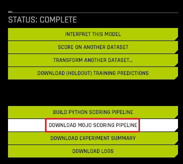

압축을 해제하면 폴더 내용은 다음과 같습니다.  
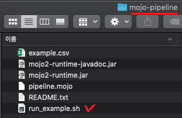

`run_example.sh`의 코드는 다음과 같습니다. 
~~~sh
#!/usr/bin/env bash
#단순히 example.csv의 Prediction값을 출력하는 코드
set -e
MOJO_FILE="${1:-pipeline.mojo}"
CSV_FILE="${2:-example.csv}" #이부분이 csv파일의 변수
LICENSE_FILE="${3}"
#mojo 파일 실행
CMD_LINE="java -Xmx5g -Dai.h2o.mojos.runtime.license.file=${LICENSE_FILE} -cp mojo2-runtime.jar ai.h2o.mojos.ExecuteMojo"

cat <<EOF >&2
======================
Running MOJO2 example
======================
MOJO file    : ${MOJO_FILE}
Input file   : ${CSV_FILE}
Command line : ${CMD_LINE} ${MOJO_FILE} ${CSV_FILE}
EOF

${CMD_LINE} ${MOJO_FILE} ${CSV_FILE}
~~~

### 5.3 Costom sh
이 코드를 약간 수정해서 csv를 임의로 지정할 수 있게 만들어 줍시다.
~~~sh
#!/usr/bin/env bash
#단순히 example.csv의 Prediction값을 출력하는 코드
set -e
MOJO_FILE="${1:-pipeline.mojo}"
#CSV_FILE="${2:-example.csv}" 
LICENSE_FILE="${3}"
#mojo 파일 실행
CMD_LINE="java -Xmx5g -Dai.h2o.mojos.runtime.license.file=${LICENSE_FILE} -cp mojo2-runtime.jar ai.h2o.mojos.ExecuteMojo"

#사용자 입력을 받는 부분
echo -e "submit csv file (only name) : \c"
read CSV_FILE

#파일형식지정
CSV_FILE+=".csv"

#입력확인
echo $CSV_FILE

cat <<EOF >&2
======================
Running MOJO2 example
======================
MOJO file    : ${MOJO_FILE}
Input file   : ${CSV_FILE}
Command line : ${CMD_LINE} ${MOJO_FILE} ${CSV_FILE}
EOF

${CMD_LINE} ${MOJO_FILE} ${CSV_FILE}
~~~

shell파일을 실행시켜보면 `example.csv`에 대한 앞서 만들었던 모델로 prediction을 하는 것을 확인할 수 있습니다.
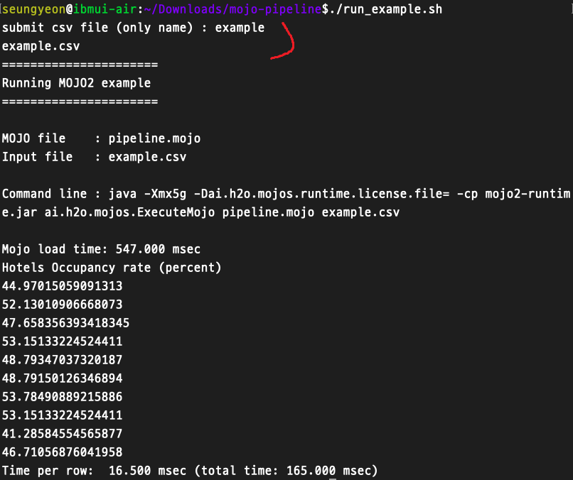

